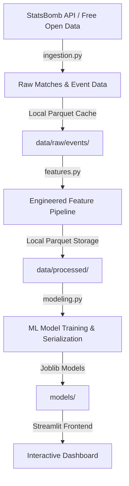

# ⚽ Pressing Intensity & Match Outcomes Analytics System
> **BSc Final-Year Thesis Project Dashboard**  
> *Academic Focus: "Pressing Intensity & Its Impact on Defensive Structure and Match Outcomes in Professional Football"*

---

## 📋 System Overview & Architecture

This is a professional-grade, interactive analytics dashboard built on **StatsBomb Open Data**. It provides football analysts, coaches, and researchers with a research-grade environment to ingest, clean, cache, engineer features, model, and visualize pressing structures in professional football.



### Core Architecture Components:
*   **Data Ingestion & Local Caching (`src/ingestion.py`)**: Fetches match metadata and event-level logs programmatically from StatsBomb, caching raw JSON events to high-performance local Parquet files to prevent repeated network requests.
*   **Feature Engineering Pipeline (`src/features.py`)**: Builds spatial, temporal, and match-level metrics (e.g. PPDA, pressing zones, counter-press indicators).
*   **Machine Learning Engines (`src/modeling.py`)**: Trains classifiers to predict the success of individual pressure actions and regressors to evaluate match outcomes based on pressing profiles.
*   **Tactical Visualizations (`src/viz.py`)**: Generates custom kernel density estimate heatmaps, spatial regains scatter plots on StatsBomb-dimensioned pitches, and rolling pressing intensity timelines.
*   **Unified UI Styling & State Routing (`src/app_helper.py`)**: Customizes Streamlit with a premium dark cyber-emerald theme, implements persistent query parameter routing (preserving dataset selection across different pages), and manages sidebar widgets.

---

## 🔬 Core Analytical & Mathematical Concepts

All metric calculations are aligned with modern football analytics frameworks:

### 1. PPDA (Passes Allowed per Defensive Action)
PPDA is the standard metric used to quantify pressing intensity. It is calculated inside opponent defensive zones (specifically the attacking $60\%$ of the pitch from the pressing team's perspective, representing $x \ge 48$ in defending team coordinates):

$$\text{PPDA} = \frac{\text{Opponent Passes Completed in Opponent's Defensive } 60\%}{\text{Pressing Team's Defensive Actions in Opponent's Defensive } 60\%}$$

*   **Defensive Actions** counted include: Tackles, Interceptions, Challenges, Fouls, and Duels.
*   A **lower PPDA** value indicates higher pressing intensity (the team allows fewer passes before attempting to win the ball back).

### 2. Pressing Triggers
We audit the event preceding a pressure action to determine tactical triggers:
*   **Backward Pass**: Opponent passing back towards their goal.
*   **Poor Touch / Miscontrol**: Opponent players failing to control the ball.
*   **Pass Reception / Build-up**: Standard receiving actions under pressure.
*   **Carry / Dribble**: Pressuring players carrying the ball.

### 3. Counter-Pressing (Gegenpressing)
A pressure event is classified as a **Counter-Press** if it occurs within **5 seconds** of the pressing team losing possession.

### 4. Pressing Success (Ball Regain)
A pressure event is classified as **Successful** if the pressing team wins possession of the ball (via tackle, interception, opponent mistake, or clearance) within **5 seconds** of the pressure action.

### 5. Dangerous Regains
A successful regain is flagged as **Dangerous** if it leads to a shot on goal by the pressing team within **15 seconds** of winning the ball back.

---

## 🧠 Machine Learning Engine & Explainability

The system features two machine learning models designed to model pressure at both micro (event-level) and macro (match-level) scales.

### 1. Pressing Success Classifier (Event-Level)
*   **Goal**: Predict whether an individual pressure action will result in a ball regain.
*   **Algorithm**: **XGBoost Classifier** (optimized via binary classification loss) evaluated against a **Logistic Regression** baseline.
*   **Features**: Spatial coordinates ($x$, $y$), distance to goal, trigger type, counter-press flag ($0/1$), score differential (goal lead/deficit), match minute, period, and under-pressure flags.
*   **Explainability**: Utilizes **SHAP (SHapley Additive exPlanations)** values to estimate feature contributions (e.g., showing how pressing closer to the opponent's goal increases the probability of a successful regain).

### 2. Match Outcome Predictor (Match-Level)
*   **Goal**: Predict match outcomes (Win, Draw, Loss) based on a team's aggregate pressing metrics.
*   **Algorithm**: **Random Forest Classifier** evaluated against a **Logistic Regression** baseline.
*   **Features**: PPDA, total pressures applied, success rate (%), counter-pressing count, dangerous regains, pressing distribution by zone (Defensive, Middle, Attacking Thirds), and possession percentage.

---

## ⚡ System Optimizations & State Routing

### 1. Match Sampling Cap (No More Timeouts)
Ingesting raw StatsBomb event data for complete seasons (like La Liga or Premier League containing 380 matches) can exceed gigabytes of RAM and cause network timeouts.
*   The pipeline now caps match ingestion at a **maximum of 25 matches per dataset**.
*   This sampling is done **deterministically** (using a fixed random seed `42`) to guarantee reproducible cache files.
*   25 matches (~50 aggregated team-match rows) provide a highly representative sample containing plenty of Wins, Losses, and Draws to train the models without exceeding browser session times.

### 2. Single-Page State Routing
Streamlit normally clears all `st.session_state` variables during browser page navigations or refreshes.
*   We implemented a query parameter synchronization layer. Whenever a competition is selected, its IDs are written to the browser's URL (e.g., `?comp=9&season=281`).
*   All custom sidebar navigation links dynamically inherit these query parameters.
*   On page loads, the parameters are read and used to restore the selected competition, keeping the active dataset locked across all dashboard tabs!

---

## 💻 Installation & Setup

### Prerequisites
*   Python 3.9, 3.10, or 3.11
*   An active internet connection

### Step 1: Create a Virtual Environment
Clone this repository and open a terminal inside the root directory:
```bash
python3 -m venv venv
```

### Step 2: Activate the Virtual Environment
*   **macOS/Linux**:
    ```bash
    source venv/bin/activate
    ```
*   **Windows (CMD)**:
    ```cmd
    venv\Scripts\activate
    ```

### Step 3: Install Dependencies
```bash
pip install -r requirements.txt
```

---

## 🚀 Running the System

### 1. Bootstrap the Application
Before running the dashboard, you need to download a default competition dataset (Women's World Cup 2019) and bootstrap the cached models:
```bash
python verify_pipeline.py
```
This script will build features and train models on the sample dataset.

### 2. Start the Streamlit Application
Launch the server from the root directory:
```bash
streamlit run app.py
```
Streamlit will automatically open the dashboard in your default browser at:
**`http://localhost:8501`** (or `http://localhost:8502`).

### 3. Explore & Download Other Competitions
Once the app is open:
1. Use the sidebar selectbox to choose any other competition (e.g., `1. Bundesliga`, `Champions League`, `FIFA World Cup`).
2. Click the **`📥 Download & Build Pipeline`** button.
3. The app will fetch the sampled matches, extract features, fit models, and cache them locally in under 30 seconds.
